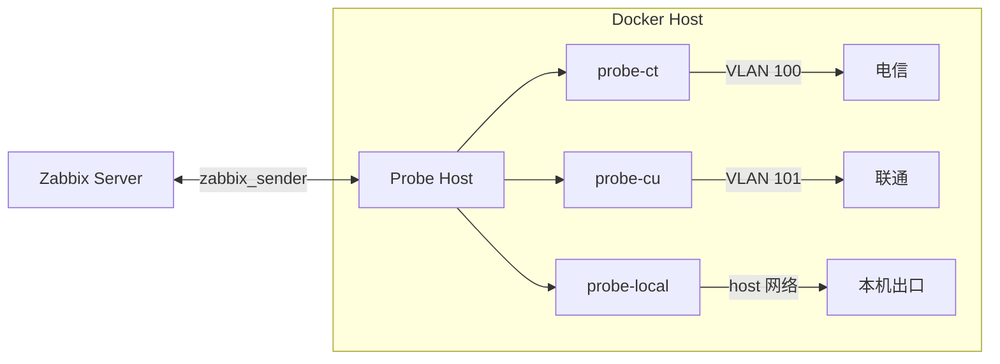

# Broadband Probe：多出口网络质量监控系统

这是**纯标准 Markdown 格式**，无多余代码块包裹，可直接粘贴为 `README.md` 使用：

# 📡 Broadband Probe

多出口网络质量监控系统（Docker + macvlan + Zabbix）

---

## ✨ 项目简介

Broadband Probe 是一个面向企业网络环境的多线路质量监控系统，用于检测不同出口链路的：

- 延迟 / 丢包 / 抖动（MTR）

- DNS 解析能力

- HTTP 可用性

- TCP 连通性

- 公网出口 IP

支持：

- 多运营商（电信 / 联通 / 移动）

- 多出口对比

- 自动发现（Zabbix LLD）

- 自动部署（类似 Terraform）

---

## 🧠 架构


---

## 🚀 核心特性

- ✅ 多线路探测（macvlan）

- ✅ 支持宿主机出口（host 模式）

- ✅ 多 MTR 目标

- ✅ 自动生成 docker-compose

- ✅ 配置与代码分离（安全可开源）

- ✅ Zabbix 自动发现

---

## 📦 目录结构

```Plain Text

broadband-probe/
├── config/
│   └── global.example.yaml
├── inventory/
│   ├── networks.example.csv
│   ├── probes.example.csv
│   └── probe_targets.example.csv
├── tools/
│   ├── generate_configs.py
│   └── setup_networks.sh
├── image/
│   └── app/
├── deploy.sh
├── README.md
└── .gitignore
```

---

## ⚡ 快速开始

### 1️⃣ 克隆

```Bash

git clone https://github.com/yourname/broadband-probe.git
cd broadband-probe
```

### 2️⃣ 初始化配置

```Bash

cp config/global.example.yaml config/global.yaml
cp inventory/networks.example.csv inventory/networks.csv
cp inventory/probes.example.csv inventory/probes.csv
cp inventory/probe_targets.example.csv inventory/probe_targets.csv
```

### 3️⃣ 修改配置

```Bash

vim config/global.yaml
vim inventory/*.csv
```

### 4️⃣ 构建镜像

```Bash

cd image
docker build -t broadband-probe:latest .
```

### 5️⃣ 部署

```Bash

cd ..
./deploy.sh
```

---

## 🌐 网络模式说明（重点）

本项目支持两种网络模式：

### 🟢 macvlan（多线路）

用于模拟真实出口（电信 / 联通等）

特点：

- 独立 IP

- 独立网关

- 真实出口路径

### 🔵 host（本机出口）

直接使用宿主机网络

特点：

- 使用默认出口

- 无需 VLAN

- 适合做基准对比

---

## 🧾 配置说明

### 📌 networks.csv（仅 macvlan 使用）

```Plain Text

network_name,vlan_id,parent_if,subnet,gateway
macvlan-100,100,eth0,192.168.100.0/24,192.168.100.1
```

### 📌 probes.csv（核心）

```Plain Text

name,zbx_host,checks,public_ip_url,network_mode,network_name,ip,dns_servers
probe-ct,Probe-CT,"mtr dns http publicip",https://4.ipw.cn,macvlan,macvlan-100,192.168.100.10,"223.5.5.5"
probe-local,Probe-LOCAL,"http dns publicip",https://4.ipw.cn,host,,,"223.5.5.5,119.29.29.29"
```

|字段|说明|
|---|---|
|name|容器名称|
|zbx_host|Zabbix 主机名|
|checks|启用模块|
|network_mode|macvlan / host|
|network_name|macvlan 使用|
|ip|macvlan 使用|
|dns_servers|DNS 服务器|
### 📌 probe_targets.csv

```Plain Text

probe_name,module,target,id,label,extra
```

示例

```Plain Text

probe-ct,mtr,223.5.5.5,ali-anycast,阿里Anycast,
probe-ct,mtr,119.29.29.29,tencent-anycast,腾讯Anycast,
probe-ct,dns,223.5.5.5,ali-dns,阿里DNS,www.baidu.com
probe-ct,http,https://www.baidu.com/,baidu-home,百度官网,
```

### 🚨 规则

- ✔ 同一个 probe 内 id 必须唯一

- ✔ id 用英文（用于 key）

- ✔ label 用中文（用于展示）

---

## 📊 支持的探测

|类型|说明|
|---|---|
|mtr|延迟 / 丢包 / 抖动|
|dns|解析能力|
|http|可用性|
|tcp|端口连通|
|publicip|出口 IP|
---

## 🔍 Zabbix 模板

### Discovery

```Plain Text

mtr.discovery
dns.discovery
http.discovery
tcp.discovery
```

### Item示例

```Plain Text

net.loss[{#MTRID}]
dns.status[{#DNSID}]
http.time[{#HTTPID}]
```

---

## 🔒 安全设计

- 代码进镜像

- 配置运行时挂载

- 不会包含：

    - 内网 IP

    - 密码

    - Token

---

## 🛠 常见问题

### ❌ 无法访问外网

- VLAN 未打通

- 网关错误

### ❌ Zabbix 无数据

- 主机名不一致

- 模板未绑定

### ❌ MTR 不显示

- discovery 未执行

- id 重复

---

## 🧭 Roadmap

- Web UI

- SLA 报表

- Grafana 支持

- 自动模板生成

---

## 📄 License

MIT License

---

## ⭐ Star 一下支持一下

如果这个项目对你有帮助，欢迎点个 Star ⭐
> （注：文档部分内容可能由 AI 生成）
